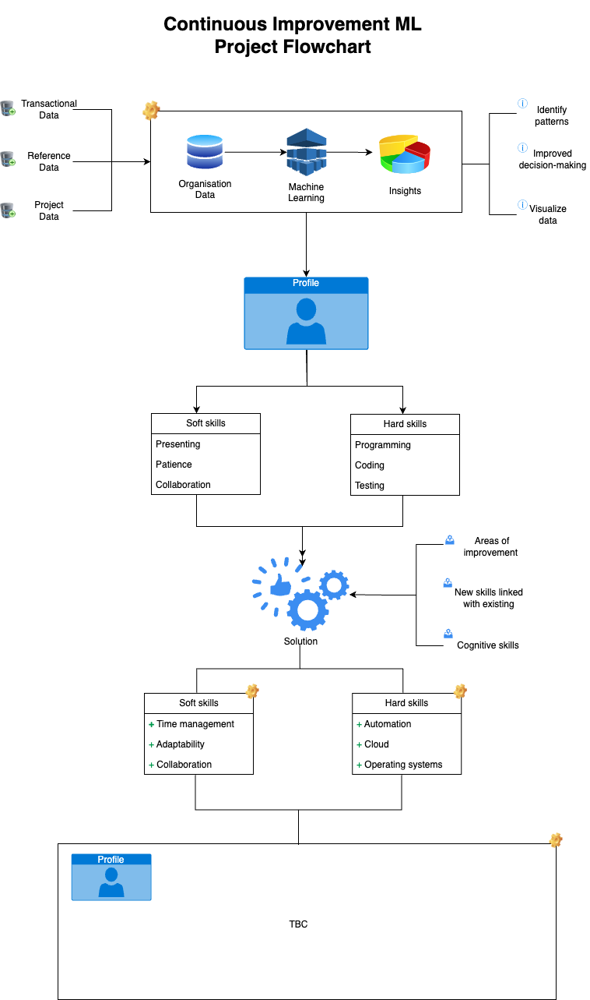

# Continuous improvement machine learning project

## Background

I recently watched the movie [The Mill (2023)](https://en.wikipedia.org/wiki/The_Mill_(2023_film)) in which a man is kept in a cell by his employer Mallard. The main protagonist Joe has been locked in the cell due to poor performance and is being held captive as part of an *"advanced career training"*  to become the best version of yourself.

> *"Your company for life"* - Mallard

Mallard is an artificial intelligence (AI) that monitors employee performance and places them in a cell when performance is deemed unsatisfactory  with the intention to ensure employees "[d]on't undervalue [themselves], [as they] are a crucial part of [the] team" and Mallard is there to help them continue to grow.

Mallard philosophy is good enough, is not good enough. Humans should always push for more and shouldn't settle for what they can achieve.

## Context

Every company is using some form of employee key performance indications (KPIs), which are objective performance standards that set benchmarks for success. It is often used to gauge if an employee is on track to meet the objectives set. These goals are supposed to motivate and engage employees to do their best work with clear, attainable goals.

I can't speak for everyone as I have no evidence for this, but often times I set these objectives with my line manager and forget about it until my next performance review to see if I have completed my objectives. This behaviour may not be the same for all companies, but might be evident in large companies (10,000+) in which line managers have multiple employees to look after and there might be an assumption that the employee is actively working towards these objectives.

> "[ . . . ] performance serves as an exemplar of your ever ascending capabilities. By embracing the challenge of exploring your limits, you are forging a path toward the promise of your innate potential, perpetuating the cycle of growth and self-discovery" - Mallard

Poor performance in companies can lead to being fired from your job - a team is only as good as its leader [^1]. But how much support is an employee provided and how can we actively push employees to continue to grow and be a better version of themselves?

## Case in point

In big consultancy companies such as McKinsey & Co, Bain & Co, Boston Consulting Group (BCG) etc. That hire over 10,000+ employees, those not in upper-management, are often at the mercy of their manager who will use feedback received to determine how well an employee is performing against KPIs set. In these large consultancy companies, metrics is everything - if you're not performing as expected - then you're under performing.

In consultancy firms, you're left to your own device to find your next project, the down time between project means you are not billable and as mentioned earlier metrics is everything. These firms would like to see high utilisation of their employees.

If an objective has been set for an employee they should be actively supported til completion. For example you might have a Software Engineer at BCG whose objective is to gain hands on experience with a cloud provider. But what is done to help them achieve this objective?

- Is their line manager actively trying to find them a new project to help achieve this?
- How easy is it to find a project that provides this exposure? Are they reliant on someone else to help them.
- What happens when that objective is not reached? Are they now deemed as underperforming - whose at fault?

## Idea

The idea is to use available organisation data and employee details / feedback, to help individuals achieve their objectives. Rather than have an employee think of objectives for the year, they should be provided with suggestions that align with the feedback they received from others and that will help them accomplish their KPIs successfully and help them grow.

Note that I have specifically used the word 'suggest' rather than 'recommend'. As suggest[^2] means:

> *Suggest*
> __
> to mention an idea, possible plan, or action for other people to consider

While recommend[^3] means:

> *Recommend*
> __
> to suggest that someone or something would be good or suitable for a particular job or purpose, or to suggest that a particular action should be done

The choice of word is very important, as we do not want to *force* objectives onto people or give any impression they *must* do this to perform well. The employee should be the one to make the final choice.

> "Just make sure to keep me in the loop, alright?" - *A manager somewhere...*

We want to encourage a continuous feedback loop at all times. If an employee has successfully completed a milestone in their objective - they should be given more feedback on how to proceed forwards - what more can they do and also highlight things happening within the organisation they can join.

> Feedback loop definition
> __
> In general, any feedback loop should have the primary three stages. During the first stage, we capture and store the input - this is the data with which we operate every day. Within the second one, we actually analyze the input, gathered from stage one. Finally, during the last stage, we need to make decisions based on the insights gained from the second stage[^4].

To keep it simple, the idea is identify areas of improvement and/or new skills that will expand an employees' skill set. Then guide them throughout by providing all the necessary information and opportunities to help them succeed in accomplishing their goal and better themselves and the organisation.

## Use case examples

Once a objective has been set, available data will be used to assist the employee achieve their KPI. Some use cases of how the solution will help people achieve their KPIs have been listed below.

### Example 1

> Employee A
> __
> Objective: Participate in a company environmental, social and corporate governance (ESG) event.

Employee A objective is to demonstrate ESG within their organisation. They would be suggested ESG projects that are aligned with having an impact on sociability - for example creating a platform to help farmers increase their crop yields etc. It does not necessary have to be a project, could potentially be an event that their organisation has arranged that they could volunteer to take apart of.

### Example 2

> Employee B
> __
> Objective: Learn to code in Python

Employee B objective is to learn a new programming language. If we were to hypothetically look into the employees' record we could see that their proficient programming is language C++. And the objective they set is to broaden their language. They could be provided with projects that are using the Python language, but we must understand the skill set already available on the project.

We want to enable people and not unknowingly hinder them. The idiom "The blind leading the blind" is very important here as we want to give people the best opportunity to learn. Understanding the different skill levels on a project is detrimental, a team with only junior engineers may not know the most efficient way to write clean code in Python, in comparison to a Senior Python engineer who has in-depth knowledge of Python.

Employee B ideal environment should have a good balance of people with years of experience with Python, so they can learn the standards and if they make any mistakes, have someone more familiar who is able to direct them on the right path.

> [!NOTE]
>
> The more detailed an objective is, the more specific suggestions will be.

Alternatively, if Employee B had no programming experience. Then they would be provided with different suggestions, such as training materials that past employees have taken and have highly rated. Followed by, a suitable project to help the employee implement what they have learned, supported by their fellow colleagues.

### Example 3

This example is different to the ones listed above. An employee has received feedback from their colleagues.

> Feedback received
> __
> I would find it helpful if you could provide more context when giving updates. That way, I can understand the situation better and provide better feedback.

With the feedback provided a new objective can be suggested for the employee to set.

> Suggested objective
> __
> Ensure that context is provided in a concise and easily understandable format, avoiding unnecessary jargon or technical terms.

The objective is clear as it provides some pointers on how to accomplish it. Just like before, training materials for effective communication can be provided -- if we wanted to go even further a example topic could be provided for the person to talk about.

If the employee is on a project and we are aware of upcoming tasks that would allow them to demonstrate what they have learned, they could potentially take up that opportunity or any future opportunities they feel comfortable with. Additionally, a helping hand could be provided in the form of understanding the audience present, so the appropriate level of communication is used.

## Workforce Intelligence

Workforce intelligence is a relatively new term, the idea is that AI is collecting information on each employee to understand what they do during work and allow managers to understand obstacles and distractions that undermine productivity. Workforce intelligence is closely related to the proposed idea / solution.

> "Workforce intelligence transforms workforce data into actionable insights that inform an organization’s strategic and tactical business decisions. Workforce intelligence provides analytics and insight into your: People, Projects, Project pursuits and opportunities[^5]"

Best in class employers proactively address key workforce issues by combining organisational data and employee listening to understand causes and put in place actionable plans to address these issues. Advanced companies use machine learning, artificial intelligence and nudge technology to embed these changes, ultimately improving employee engagement and productivity[^6].

## Proposed solution

With the large amounts of data available, from human resource (HR) records containing each employees skill set and their performance each year. We can highlight room for improvements within each individual and suggest ways to help them continuously improve.

This will allow organisations to have a much better skill visibility and be able to retain their workforce, with tailored pathways to help each individual. As the data is now being used effectively, people with the right skills can be quickly identified and placed in the right places, were the skills are needed and allows for better forecasting of ongoing work and potential future work.

Through machine learning we can identify trends and patterns, to distinguish the difference between junior members to senior employees. And understand why junior employees are more willing to take on new opportunities in comparison to senior employees and why?

### Machine learning

[word2vec](https://www.tensorflow.org/text/tutorials/word2vec)  algorithm can be used to learn word associates from large amount of text held within the organisation. This would be through unsupervised learning as data would be coming from all aspects of the organisation. Perhaps this might be too much to train the model and potentially too time consuming?

Additionally, we can use [Matrix factorization](https://developers.google.com/machine-learning/recommendation/collaborative/matrix) which is used in existing recommendation systems. This is a good starting point, as the model can help discover new interests amongst employees and make suggestions based on similar employees.

> [!NOTE]
> My understanding of machine learning is still in the early stages, I have mentioned these these processes as this what I have come across so far.

### Artificial intelligence

These forms of AI can be beneficial below are a couple identified and what they can help achieve.

- Sentiment analysis
  - Identify if employee feedback was positive, negative or neutral. Can be linked with various data. For example, determine reviews of training undertaken by others was helpful or not. This can help with ensuring *good* materials are provided.
- Named entity recognition (NER)
  - Categories text.
- Entity linking
  - Helpful to link with existing data within the company.
- Chatbot and/or Question answering
  - Potentially helpful for individuals to have somewhere to query information that has been provided to them. For example, why X has been recommended and the reasoning.
- Video Indexer
  - Used to extract insights from videos (Seems to be a service provided by Microsoft).

## Plausible Benefits

1. Improved employee engagement
2. Workforce intelligence
3. Reduce cognitive abilities aging

## Summary

In summary, organisations have large amounts of data, containing what is happening in all areas, why not centralise this data and use it to benefit their employees through career growth and self improvement. Employees being given opportunities to upskill and keep providing value, means we can improve employee satisfaction within organisations.

## Further questions

Below are a list of questions that would be interesting to see answered, i if the solution was to be implemented:

- Is encouraging people to always improve, breed a competitive company culture?
- How do you measure the success of an employee taking on a suggestion? Not all improvements can be measured, especially those that build peoples character.
- As no one is being forced into doing things they don't want to, how will performance compare to employees who are actively incorporating suggestions provided vs those who do not wish to use any of the suggestions.
- Will a skill ceiling still exist, if we're always striving for self improvement?

[^1]: A Team Is Only As Good As Its Leader by [PeopleTek](https://peopletekcoaching.com/2022/08/02/a-team-is-only-as-good-as-its-leader-yes-or-no/)
[^2]: Suggest definition by [Cambridge Dictionary](https://dictionary.cambridge.org/dictionary/english/suggest)
[^3]: Recommend definition by [Cambridge Dictionary](https://dictionary.cambridge.org/dictionary/english/recommend)
[^4]: What Are Feedback Loops and Why You Need to Implement Them? by [Mila Chervenkova](https://businessmap.io/blog/feedback-loops)
[^5]: Your ultimate guide to workforce intelligence by [Bridgit](https://gobridgit.com/workforce-intelligence-guide/)
[^6]: Workforce Intelligence by [Price Water Coopers](https://www.pwc.co.uk/services/human-resource-services/intelligence.html)

---
#ml #ai #ideas
