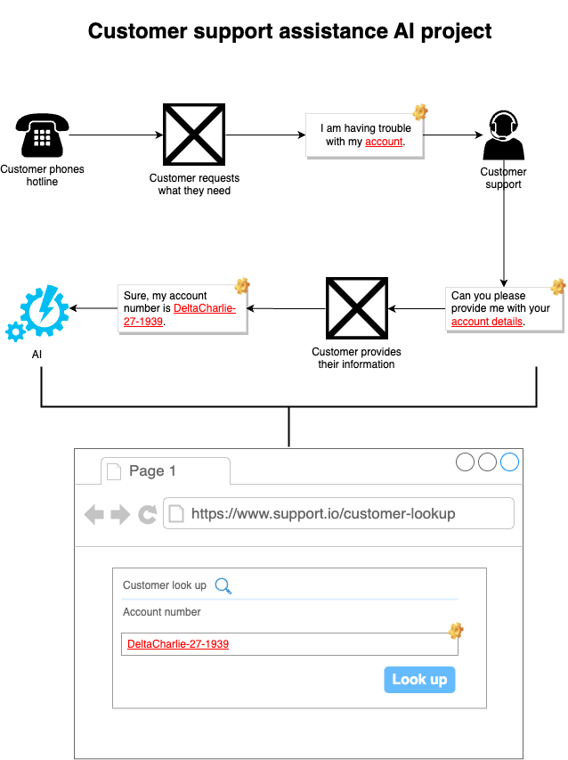

# Customer support assistance AI project

## Background

As a firm believer that artificial intelligence (AI) will aid people in becoming more efficient at work and should be seen as improvement. One industry I have found that would benefit significantly from using AI is the customer support industry.

Working within customer support, employees have to deal with numerous customers, enquiring about different things. Often, you would find that there are departments that handle certain cases and will need to be transferred.

## Context

When calling a customer support hotline, information needs to provided to ensure you are connected to the correct person who can help with your inquiry. If the person you connected with is unable to assist you, they will transfer the call to someone who can help.

Too often, you will find the need to repeat the same information to this person, before they can proceed further.

## Case in point

I have had to phone customer support in the past to help with a request. And found myself having to give the same information, to several people and left me confused because this information wasn't being passed across. This resulted in frustration as it meant that the issue was not being resolved and rather being prolonged.

And in some cases, I will have to wait for a call from someone else who can assist and hope the information captured is correct.

## Idea

The idea is to use AI, to listen into customer phone calls and actively take notes to assist the employee handling the request. This could be in the form of helping the employee navigate through their in-house application to find the necessary information, which will result with helping resolve the customer request quicker.

Rather than, "can you please hold while I pull up your file..." the information would have already been presented to the employee and allow them to continue with assisting the customer and remove the wait in between trying to find certain information.

Ideally, the AI would be populating the correct fields that the employee can see on their screen, for example the customer might need to provide their first and last name in order to find their account. The solution would understand the key information that the customer has provided and pre-populate these fields.

This will benefit both the customer and the employee as they will be able to resolve requests much quicker and if the call needs to be forwarded to another person, all information has already been captured and there isn't too much of a reliance on the person handling the call to complete any forms during the call.

As there is now a transcript of the call between the customer and the employee, if the case needs to be looked at in the future, everything would have been captured and a summary could be provided.

## Use case example

### Example 1

The customer has called in to reset their account password. The call transcript might be the following _(lines crossed out is what we are to eliminating)_:

> **Customer**: I need help resetting my account password.
> 
> **Support**: Sure, I am able to assist, can you please provide me with your account number.
> 
> **Customer**: It is DeltaCharlie-27-1939
> 
> ~~**Support**: Thank you for providing this information, please wait while I find your account details.~~
> 
> [ ~~-- customer placed on hold ---~~ ]
> 
> ~~**Support**: Sorry for the wait, I have your account details now open.~~
> 
> **Support**: I can see your account is locked, I'll go ahead an unlock your account and reset your password.
> 
> ....

In this example, we want to eliminate the need to put the customer on hold. This may because that the employee needs to navigate to the page to enter the customers information, while actively listening to the customer. There may be instances, where the information the customer provided may be incorrect and will be placed on hold again to find the account details again.

### Example 2

The customer has called for assistance, but has been redirected to the wrong department and needs to have their call transferred _(lines crossed out is what we are to eliminating)_.

> **Customer**: I have locked my account and have tried several times to reset my password, but have not been able to.
> 
> ~~**Support**: Thanks for calling, but I am unable to help with account enquires. I will need to transfer your call. Is this okay?~~
> 
> ~~**Customer**: Sure, go ahead.~~
> 
> [ ~~-- customer placed on hold --~~ ]
> 
> ~~**Support**: Hello, my name is Johnny - how can I be of assistance.~~
> 
> ~~**Customer**: I have locked my account and have tried several times to reset my password, but ave not been able to.~~
> 
> **Support**: Sure, I am able to assist, can you please provide me with your account number.
> 
> ...

In this example, the customer has called for help with their account. However, the customer support employee is unable to help with their request as they are unaware of the process and need to have the call transferred. In this instance, the call is transferred successfully to someone who is able to assist the customer. Note, that the customer had to repeat the same information again to the person they were transferred to.

Luckily, there was someone ready to take the customers call after being transferred. However, if there is no available people to assist, they would be placed on hold for a long time or potentially have to have someone call them back when they are free to assist.

## Proposed solution

The proposed flow is the following:
1. Customer calls customer support for assistance,
2. They are redirected to the appropriate customer support employee,
3. Through out the call, the AI solution will be listening for key information e.g.
	1. Account details,
	2. Assistance being asked for,
4. When these key information are found, the AI solution will assist the employee by e.g.
	1. Populating fields in the in-house software to find customer information,
	2. Retrieve relevant information from knowledge base to assist the employee, for example display steps to perform a certain actions.
	3. Attempt to assist the employee navigate through the software to get to the necessary page(s).

In the example flow above, the user has called customer support to resolve an issue with their account. The AI solution, would have open the relevant page(s) / screen that is needed to start the process to resolve the users account issue. In this instance, the users account number is needed and through 'Speech-to-text' would have populated the 'Account number' field for the employee.

### Artificial Intelligence

- Speech to text
	- Transcribe audio into text.
- Sentiment Analysis
	- Determine if customer interaction was positive, negative or natural. Can be used to highlight
- Search
	- As all transcripts will be indexed, allows for AI integration.
- Summarisation
	- Provide summaries for calls transcribed, without having to read the entire transcript.
- Entity recognition
	- Identify commonly used and domain-specific terms for extraction.

## Summary

TBC.

---
#ideas #ai 

