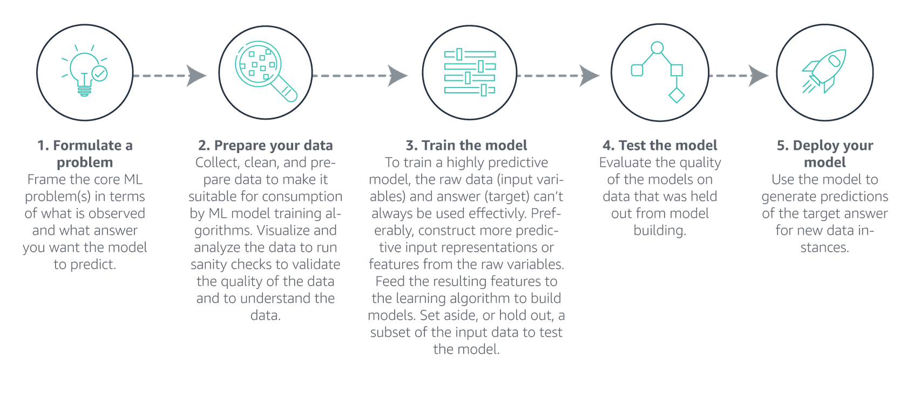

# MLS-C01 Machine Learning Specialty Notes

# What is machine learning?

Machine learning (ML) is the process of training computers, using math and statistical processes, to find and recognize patterns in data. After patterns are found, ML generates and updates training models to make increasingly accurate predictions and inferences about future outcomes based on historical and new data. For example, ML could help determine the likelihood of a customer purchasing a particular product based on previous purchases by the user or the product's past sales history.

# Fail forward

Fail forward means purposefully and deliberately using failure as a path to success. Failing forward with ML means using failure as an iterative opportunity to become fault-tolerant and find a successful direction in subsequent attempts. Many successful outcomes come after many rounds of iteration, and some aren’t successful at all.

Failure isn't damaging if changes and adjustments are small, and reattempts are encouraged.

---
#aws #ml
