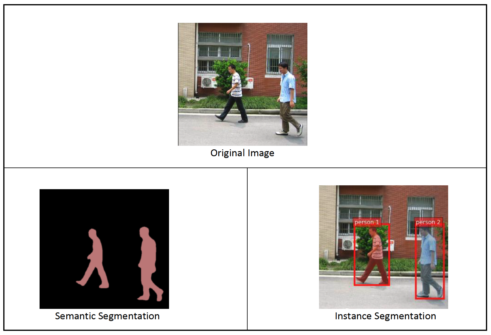

# MLS-C01 Machine Learning Specialty Built-in Algorithms

## Tabular

Tabular data refers to any datasets that are organised in tables consisting of rows (observations) and columns (features). Within supervised learning, you have different types of problems. These can be broadly categorised into two categories: classification and regression.

### Linear Learner

Linear Learner is for both classification and regression tasks. It is a supervised learning technique. For best results normalize and shuffle.

Can also be used for both classification and regression, The difference is that you set the hyperparameters ([[06-feature-engineering]]) to direct these algorithms to produce quantitative results.

### XGBoost

XGBoost is a gradient boosted tree algorithm for Classification, Regression and Ranking. It is a supervised learning technique. Subsample and eta prevents overfitting.

Can also be used for both classification and regression, The difference is that you set the hyperparameters ([[06-feature-engineering]]) to direct these algorithms to produce quantitative results.

### Factorization Machines

Factorization Machines are most often used in recommendation systems. Can be used for binary classification or regression. It is used for supervised learning. Can be used for click prediction or item recommendation. Set `predictor_type` for classification or regression. AWS recommends CPU for sparse data and GPU for dense data.

### DeepAR

DeepAR Forecasting is an algorithm for forecasting scalar time series. It is a supervised learning technique. It uses recurrent neural networks (RNNs).

Some best practices are to not break up the time series or provide a part of it, to avoid large `prediction_length`, `context_length` and `prediction_length` should be the same, total observations across training time should be greater than 300, set `prediction_length` for the number of time-steps the model is set to predict and finally autoregressive integrated moving average (ARIMA) or exponential smoothing (ETS) might get more accurate results on a single time series.

### K-Nearest Neighbors (KNN)

K-Nearest Neighbors (KNN) is an index based algorithm that uses non-parametric method for classification or regression. It can be used for unsupervised and Supervised learning. Can set `k` but, can get diminishing returns with higher value.

### K-Means

K-Means finds discrete groupings within data, where members of group are similar to each other and different from other members of other groups. It is for unsupervised learning. Web-scale version used in SageMaker is more accurate. Extra cluster centre can be used to improve accuracy. Uses k-means++ to set initial cluster centres far apart to make training better. Can use elbow method to pick `k`. Select `extra_center_factor` to use k-means++ algorithm and `init_method` to choose initial cluster centres. AWS AWS recommends CPU instances for training.

## Natural language processing (NLP)

### BlazingText

BlazingText algorithm provides highly optimised implementations of the Word2vec and text classification algorithms.

### Sequence2sequence (Seq-2-Seq)

Sequence2sequence is a supervised learning algorithm where the input is a sequence of tokens (for example, text, audio) and the output generated is another sequence of tokens.

### Object2Vec

Object2Vec is a a neural embedding algorithm that is customisable. It can find relationship between things based on pairings. Object2Vec generalises the well-known Word2Vec embedding technique for words that are optimised in the Amazon SageMaker BlazingText algorithm.

## Computer Vision

### Image classification

Image classification is a supervised learning algorithm used to classify images. Image Classification can label an image with one or more labels. It uses supervised learning with a convolutional neural networks (CNN).

### Object detection

Object detection detects and classifies objects in images using a single deep neural network. It is for supervised learning to detect objects in an image.

Object detection algorithm detects and classifies objects in images using a single deep neural network. It is a supervised learning algorithm that takes images as input and identifies all instances of objects within the image scene. The object is categorized into one of the classes in a specified collection with a confidence score that it belongs to the class. Its location and scale in the image are indicated by a rectangular bounding box.

### Semantic segmentation

Semantic segmentation algorithm tags every pixel in an image with a class label from a predefined set of classes.

Instance segmentation detects and delineates each distinct object of interest appearing in an image. It tags every pixel with an instance label. Whereas semantic segmentation assigns the same tag to pixels of multiple objects of the same class, instance segmentation further labels pixels corresponding to each occurrence of an object on the image with a separate tag.

## Unsupervised

### IP Insights

IP Insights learns usage patterns for IPv4 addresses. It is unsupervised learning. It can use it to identify logins from anomalous IP address, to trigger multi-factor authentication system and can learn vector representations/embeddings to measure similarities for clustering and visualisation (need large hash size for this). Set `num_entity_vectors` to set hash size, set to 2x unique entity identifiers. Set `vector_dim` size of embedding vectors, but too large can cause overfitting.

### Principal Component Analysis (PCA) Algorithm

Reduces the dimensionality/number of features in a dataset by finding new features called components, which are composite of original features that are uncorrelated to each other. The first component is the largest possible variability of the data, the second component is the second most variability, etc. Creates a covariance matrix and then uses singular value decomposition.

---
#aws #ml #algorithms
