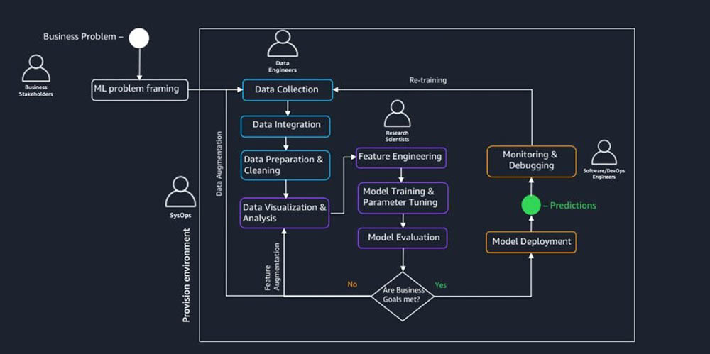

# Machine Learning Operations (MLOps)

## Goal

Understand how to use the machine learning (ML) pipelines to solve a real business problem in a project environment. Will understand each phase of the the pipeline and complete a project to solve a business problem. While using the AWS Cloud Infrastructure. As per AWS MLOps levels, this would be Level 0 (see more [[07-automated-machine-learning]]).

## Task list

- [x] Create terraform infrastructure [repository](https://github.com/kwame-mintah/terraform-aws-machine-learning-pipeline)
- [x] Provision resources needed for Amazon SageMaker
  - See [[02-machine-learning-terraform]] for resources created.
- [ ] Machine Learning life cycle (MLCL)
  - [x] Framing ML problems from business goals
  - [x] Access, prepare and process data for the model
  - [x] Architect ML solution and develop ML models
  - [x] Deploy ML models
  - [x] Iterate - Monitor, optimise and maintain the performance of the model
- [ ] Create user interface (Simple react frontend)

## Tech stack

- Github
  - Repository
  - Github Actions (CI/CD)
- Amazon Web Services
  - SageMaker
  - CloudWatch
  - S3
  - Identity and Access Management (IAM)
  - API Gateway
  - VPC
- Terraform
  - [AWS Provider](https://registry.terraform.io/providers/hashicorp/aws/latest/docs)

## Steps required

- Preparing your Amazon SageMaker notebook
- Downloading data from the internet into Amazon SageMaker
- Investigating and transforming the data so that it can be fed to Amazon SageMaker algorithms
- Estimating a model
- Evaluating the effectiveness of the model
- Setting the model up to make ongoing predictions

## Resources

- [OpenML](https://www.openml.org/): OpenML is an open platform for sharing datasets, algorithms, and experiments.
- [UC Irvine Machine Learning Repository](https://archive.ics.uci.edu/): Maintains datasets as a service to the machine learning community.

---

#aws #mlops #mlcl
