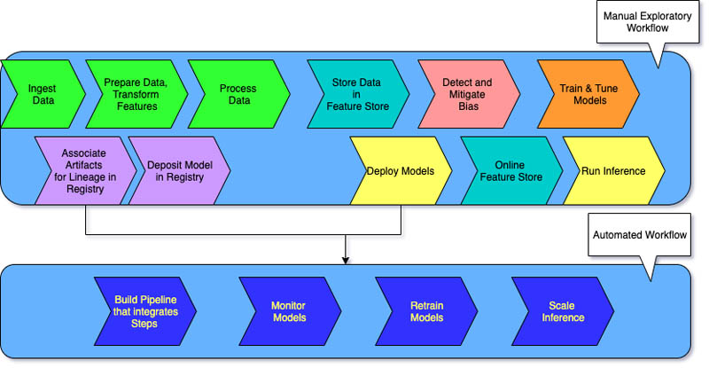

# Automated machine learning

**Automated machine learning** (**AutoML**) is the process of automating the tasks of applying machine learning to real-world problems.

## Levels of MLOps

There are three levels of MLOps implementation, depending upon the automation maturity within an organization[^1].

### **MLOps level 0**

Every step is manual, including data preparation, ML training, and model performance and validation. It requires a manual transition between steps, and each step is interactively run and managed.

### **MLOps level 1**

MLOps level 1 aims to train the model continuously by automating the ML pipeline.

In level 0, you deploy a trained model to production. In contrast, for level 1, you deploy a training pipeline that runs recurrently to serve the trained model to your other apps. At a minimum, you achieve continuous delivery of the model prediction service.

### **MLOps level 2**

MLOps _level 2_ is for organizations that want to experiment more and frequently create new models that require continuous training. It's suitable for tech-driven companies that update their models in minutes, retrain them hourly or daily, and simultaneously redeploy them on thousands of servers.

[^1]: What is MLOps? by [AWS](https://aws.amazon.com/what-is/mlops/)

---
#ml #mlops #automl