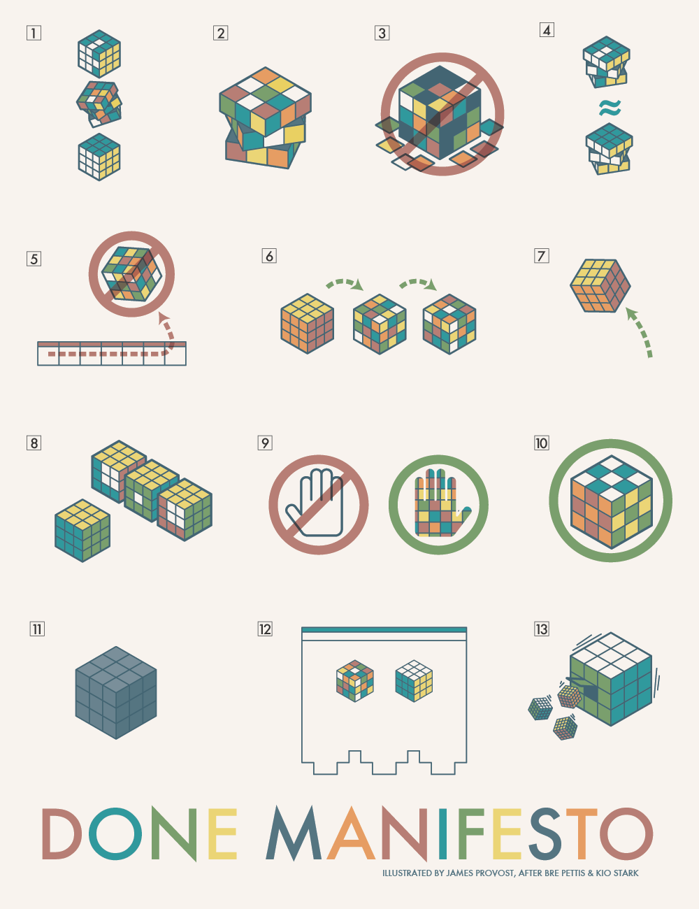

# The Cult of Done Manifesto

I recently watched The Cult of Done by [No Boilerplate](https://youtu.be/bJQj1uKtnus?si=RTYE2Ct6dPGSzz3V) and has changed how I view my personal projects. Will be using this manifesto more often, as I now understand there are various ways to complete something and it doesn't always have to be perfect... as failure counts as $done$.

## Manifesto of done [^1]

1. There are three states of being. Not knowing, action and completion.
2. Accept that everything is a draft. It helps to get it done.
3. There is no editing stage.
4. Pretending you know what you’re doing is almost the same as knowing what you are doing, so just accept that you know what you’re doing even if you don’t and do it.
5. Banish procrastination. If you wait more than a week to get an idea done, abandon it.
6. The point of being done is not to finish but to get other things done.
7. Once you’re done you can throw it away.
8. Laugh at perfection. It’s boring and keeps you from being done.
9. People without dirty hands are wrong. Doing something makes you right.
10. Failure counts as done. So do mistakes.
11. Destruction is a variant of done.
12. If you have an idea and publish it on the internet, that counts as a ghost of done.
13. Done is the engine of more.

## Done manifesto illustrated [^2]

[^1]: The Cult of Done Manifesto by [Kio Stark](http://kiostark.com/) and [Bre Pettis](https://medium.com/@bre)
[^2]: Done Manifesto by [James Provost](https://www.flickr.com/photos/jprovost/3327377382/)

---

#personal-development 